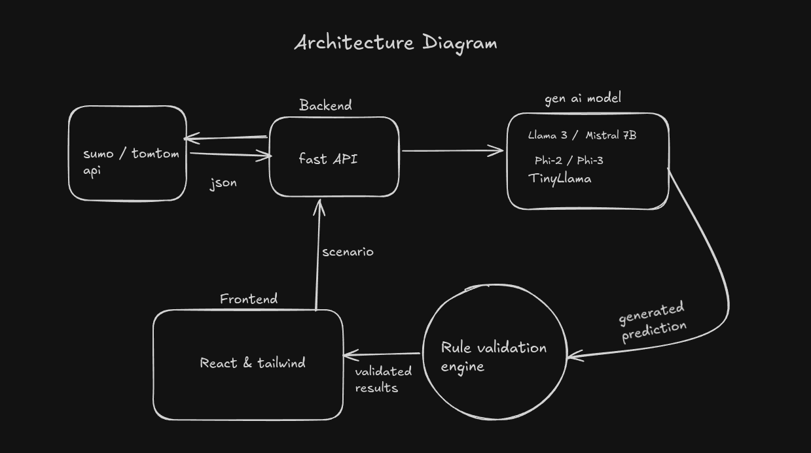

# genVANET

Generative AI-powered VANET (Vehicular Ad-hoc Network) traffic prediction and validation system.

## Architecture

## Components

- **Backend** — FastAPI server that ingests JSON data from SUMO / TomTom APIs and forwards it to the GenAI model.
- **GenAI Model** — Supports Llama 3, Mistral 7B, Phi-2/Phi-3, and TinyLlama for traffic prediction.
- **Rule Validation Engine** — Validates generated predictions before they reach the frontend.
- **Frontend** — React & Tailwind dashboard for scenario configuration and viewing validated results.
